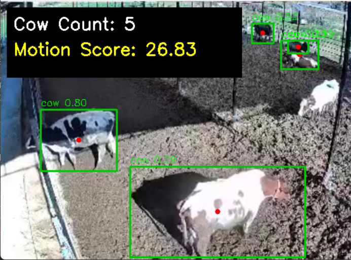

# Lisans Tezi — Hayvan Refahı İzleme (Hayvan Sayımı, Hareket Skoru, Anomali Tespiti)

Bu proje, hayvan barınaklarında veya çiftliklerde hayvan refahını izlemek amacıyla hazırlanmış bir demo uygulamasıdır. Video veya görüntü verilerinden hayvanların sayısını belirler, her hayvan için hareket skorları hesaplar ve hareket/sayımlarda anomali tespit eder. Tez çalışması kapsamında prototip ve araştırma amaçlıdır.

**Kapsam:**
- Hayvan tespiti ve sayımı
- Zaman içinde hayvan başına hareket skoru (aktivite seviyesi)
- Hareket ve sayım verilerinde anomali tespiti

**Proje Yapısı**
- `demo.py`: Projenin ana çalıştırma betiği. Video, webcam veya tek görüntü alıp işleyen giriş noktası.
- `requirements.txt`: Proje bağımlılıkları.
- `yolov8n.pt`: YOLOv8 model ağırlıkları (küçük/fast sürüm).
- `utils/motion.py`: Hareket hesaplama ve yardımcı fonksiyonlar.
- `screenshots/`: Örnek çıktı görselleri (README içinde örnek gösterildi).
- `outputs/`: İşlenmiş video, rapor ve çıktıların kaydedildiği dizin.

**Örnek Görsel**
Projeden bir örnek çıktı görüntüsü aşağıdadır:



**Gereksinimler**
- Python 3.8 veya üstü
- Paketler: `requirements.txt` içindeki paketler (ör. `ultralytics`, `opencv-python`, `numpy`, `scipy`).

Kurulum (Windows örneği):

```bash
python -m venv .venv
.venv\Scripts\activate
pip install --upgrade pip
pip install -r requirements.txt
```

**Nasıl Çalışır? (Yüksek Seviye Akış)**
1. Girdi: Video dosyası, canlı kamera veya tek görüntü alınır.
2. Nesne Tespiti: Her karede YOLOv8 modeli ile hayvan bounding box'ları tespit edilir.
3. Takip/ID Atama: Tespit edilen nesneler kareler arasında eşleştirilir ve ID atanır.
4. Hareket Skoru: `utils/motion.py` içindeki fonksiyonlar ile her ID için pozisyon değişimi ve hız kullanılarak hareket skoru hesaplanır.
5. Anomali Tespiti: Hareket skorları ve sayım zaman serileri istatistiksel veya eşik tabanlı yöntemlerle analiz edilerek anormallikler tespit edilir.

Teknik olarak hareket skoru için basit bir formül örneği verilebilir:
$$
score_t = \alpha \cdot speed_t + (1 - \alpha) \cdot activity_t
$$
Burada $speed_t$ son konum değişikliğinin büyüklüğü, $activity_t$ son N karedeki hareket yoğunluğu ve $\alpha$ ağırlık katsayısıdır.

**Çalıştırma Örnekleri**

- Tek bir videoyu işlemek ve sonucu kaydetmek:

```bash
python demo.py --source test_video/example.mp4 --save-output outputs/result.mp4
```

- Webcam ile gerçek zamanlı çalıştırmak:

```bash
python demo.py --source 0
```

- Yardım görmek için:

```bash
python demo.py --help
```

`demo.py` içindeki argümanlarla model yolu, giriş kaynağı, çıktı dosyası ve eşik değerleri ayarlanabilir.

**Çıktılar ve Raporlama**
- Görselleştirme: Her karede bounding box, ID ve hareket skoru gösterilir.
- Kaydedilen dosyalar: işlenmiş video (`outputs/result.mp4`), zaman serisi verileri (CSV/JSON) ve özet raporlar.

**Geliştirme & İyileştirme Önerileri**
- Takip için DeepSORT veya ByteTrack gibi daha güçlü yöntemler entegre edilebilir.
- Hareket ve anomali tespiti için ML tabanlı yöntemler (LSTM autoencoder, IsolationForest vb.) kullanılabilir.
- Model, farklı hayvan türleri veya sahalar için yeniden eğitilebilir.

**Etik ve Uygulama Notları**
- Saha uygulamalarında hayvan refahı, veri gizliliği ve izin konularına dikkat edilmelidir. Sistem çıktılarını insan denetimi ile destekleyin.

---

İsterseniz `demo.py` içindeki argüman listesini otomatik çekip README'ya ekleyebilirim veya `utils/motion.py` fonksiyonlarının kısa dokümantasyonunu README'ya ekleyebilirim.
